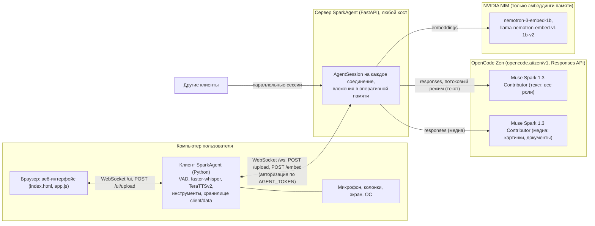
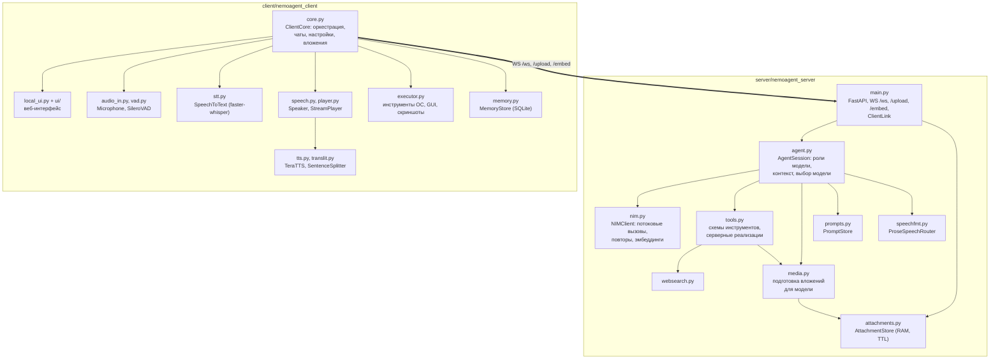
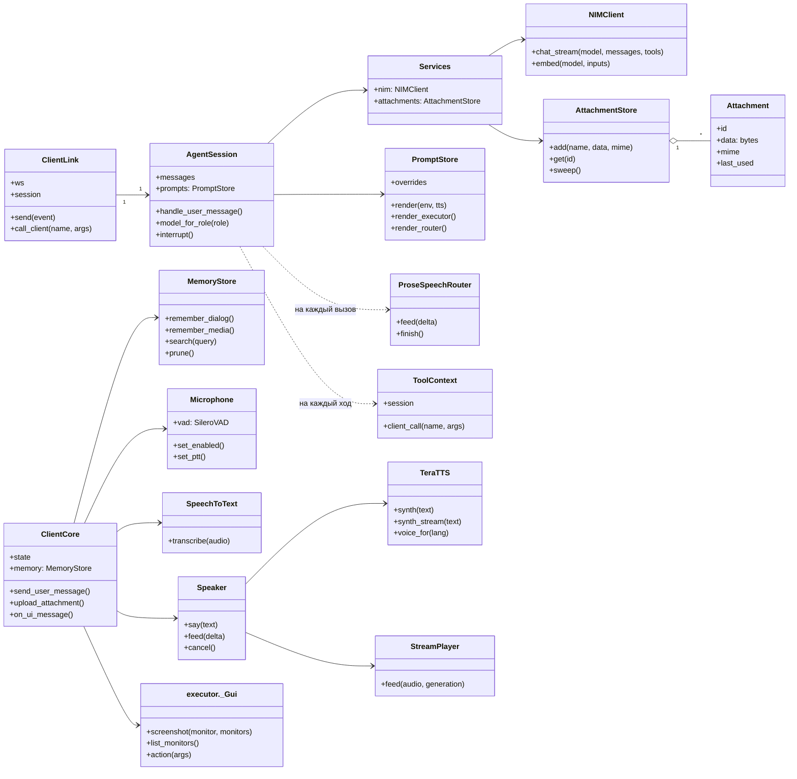
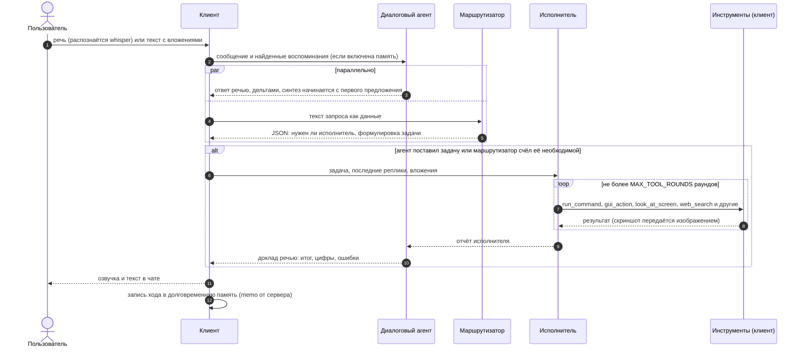
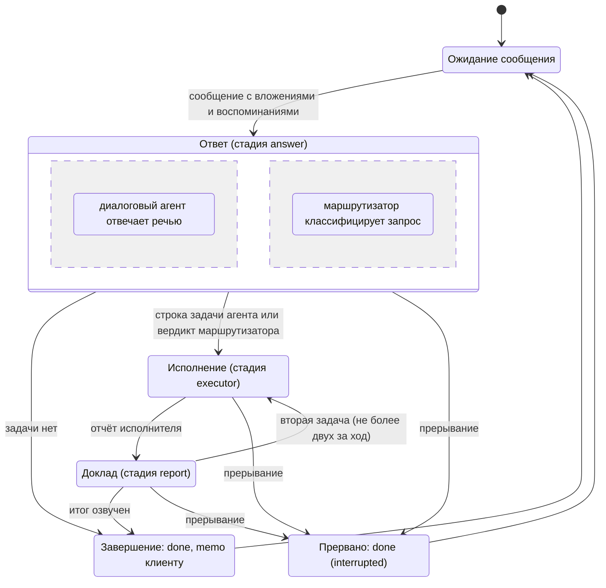
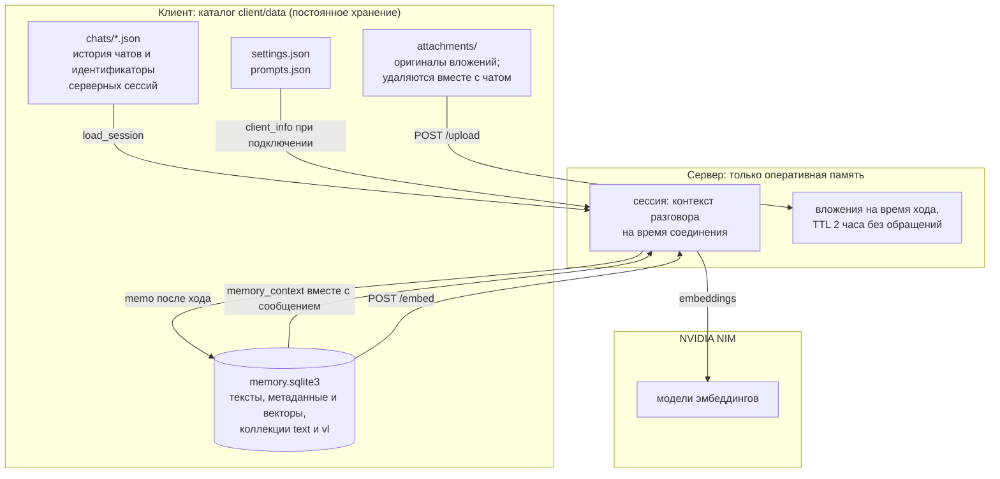

# SparkAgent

Форк NemoAgent: голосовой и текстовый ассистент с управлением компьютером, построенный по схеме
«тонкий сервер, толстый клиент». Отличие от NemoAgent — только LLM-слой: все текстовые роли
(диалоговый агент, исполнитель, маршрутизатор) и медиа-вызовы работают на модели
Muse Spark 1.3 Contributor через OpenCode Zen (Responses API). Интерфейс, распознавание речи
(faster-whisper), синтез речи (TeraTTSv2), инструменты и память — без изменений.
Долговременная память по-прежнему считается эмбеддингами NVIDIA NIM.

SparkAgent представляет собой голосового и текстового ассистента с управлением компьютером, построенного по схеме
«тонкий сервер, толстый клиент». Сервер скрывает от клиента работу с языковой моделью Muse Spark и не хранит
состояния между сеансами; клиент выполняется на компьютере пользователя и отвечает за распознавание речи,
синтез речи, исполнение команд, историю диалогов и долговременную память.

## Содержание

1. [Назначение и состав](#1-назначение-и-состав)
2. [Архитектура](#2-архитектура)
   - [2.1. Диаграмма развёртывания](#21-диаграмма-развёртывания)
   - [2.2. Диаграмма компонентов](#22-диаграмма-компонентов)
   - [2.3. Диаграмма классов](#23-диаграмма-классов)
3. [Обработка запроса](#3-обработка-запроса)
   - [3.1. Роли модели](#31-роли-модели)
   - [3.2. Диаграмма последовательности](#32-диаграмма-последовательности)
   - [3.3. Диаграмма состояний хода](#33-диаграмма-состояний-хода)
   - [3.4. Подготовка речевого ответа](#34-подготовка-речевого-ответа)
4. [Хранение данных](#4-хранение-данных)
   - [4.1. Диаграмма потоков данных](#41-диаграмма-потоков-данных)
   - [4.2. Долговременная память](#42-долговременная-память)
5. [Функциональные возможности](#5-функциональные-возможности)
6. [Производительность](#6-производительность)
7. [Установка и конфигурация](#7-установка-и-конфигурация)
   - [7.1. Сервер](#71-сервер)
   - [7.2. Клиент](#72-клиент)
8. [Пользовательский интерфейс](#8-пользовательский-интерфейс)
9. [Структура исходного кода](#9-структура-исходного-кода)
10. [Ограничения и особенности эксплуатации](#10-ограничения-и-особенности-эксплуатации)

## 1. Назначение и состав

Система состоит из двух приложений.

- **Сервер** (`server/`, Python, FastAPI). Принимает соединения клиентов по WebSocket, ведёт контекст
  разговора каждой сессии, вызывает модель Muse Spark 1.3 Contributor через OpenCode Zen (Responses API)
  и исполняет серверные инструменты (просмотр вложений, веб-поиск, чтение страниц). Для всех ролей
  (диалоговый агент, исполнитель, маршрутизатор) и для вызовов с изображениями используется модель
  `muse-spark-1.3-contributor-free`. Сервер не пишет
  на диск и обслуживает произвольное число клиентов одновременно.
- **Клиент** (`client/`, Python). Захватывает речь с микрофона (Silero VAD, faster-whisper), синтезирует
  ответы (TeraTTSv2), поднимает локальный веб-интерфейс, исполняет инструменты управления компьютером,
  хранит историю чатов, вложения, настройки, правки промптов и долговременную память в каталоге
  `client/data`.

Обе части написаны на Python 3.11 и запускаются скриптами `run_server.bat`/`run_server.sh` и
`run_client.bat`/`run_client.sh`.

## 2. Архитектура

### 2.1. Диаграмма развёртывания

Рис. 1 показывает размещение компонентов по узлам и протоколы взаимодействия между ними. Клиент и браузер
находятся на одном компьютере; сервер может располагаться на любом хосте, доступном клиенту по сети; языковая
модель предоставляется сервисом OpenCode Zen, эмбеддинги памяти — сервисом NVIDIA NIM.



*Рис. 1. Диаграмма развёртывания.*

### 2.2. Диаграмма компонентов

Рис. 2 отражает разбиение каждого приложения на модули и основные зависимости между ними. Интерфейсами
между приложениями служат три конечные точки сервера: `WS /ws` (сообщения, потоковые дельты ответа, вызовы
клиентских инструментов), `POST /upload` (вложения на время хода) и `POST /embed` (векторы для памяти
клиента).



*Рис. 2. Диаграмма компонентов.*

### 2.3. Диаграмма классов

На рис. 3 приведены основные классы обоих приложений и отношения между ними. На сервере на каждое
WebSocket-соединение создаётся объект `ClientLink`, владеющий сессией `AgentSession`; общие для всех сессий
сервисы (`NIMClient`, `AttachmentStore`) собраны в `Services`. На клиенте центральным объектом является
`ClientCore`, который владеет аудиоконвейером, исполнителем инструментов и хранилищем памяти.



*Рис. 3. Диаграмма классов (основные классы).*

## 3. Обработка запроса

### 3.1. Роли модели

Для разговора function calling не используется: вместо одного агента с инструментами работают три роли на
одной и той же текстовой модели, каждая со своим промптом (все промпты редактируются во вкладке «Системные
промпты»). Если в запросе присутствуют изображение, аудио, видео или скриншот, вызов любой роли выполняется
мультимодальной моделью.

1. **Диалоговый агент** (в интерфейсе «Голосовой агент») инструментов не имеет. Он видит и слышит вложения
   непосредственно и отвечает сразу, в речевом формате: только слова, числа и единицы прописью в нужном
   падеже, аббревиатуры раскрыты, названия транслитерированы, короткие фразы, буква ё, знак `+` для
   ударения в омографах, без дежурных концовок. Если ответ должен содержать код, команду, путь или ссылку,
   агент называет их словами, а точный текст помещает после строки `===`; эта часть выводится на экран и не
   озвучивается. Если запрос требует действия или сведений, которых у агента нет (проверить, запустить,
   открыть, найти, посмотреть на экран, выполнить поиск в интернете, вспомнить прошлый разговор), агент
   произносит одну фразу о том, что сейчас сделает, и формулирует задачу в строке, начинающейся с `>>>`.
   Ответ передаётся клиенту потоком по мере генерации (`speechfmt.ProseSpeechRouter`); последние семьдесят
   символов удерживаются, чтобы отрезать шаблонные концовки вида «Чем ещё могу помочь?».
2. **Маршрутизатор** работает параллельно с ответом диалогового агента. Он получает текст запроса как данные
   (в кавычках, с явным указанием не выполнять его) и возвращает одну строку JSON: требуется ли
   исполнитель и какова его задача. Если диалоговый агент задачу не поставил, а маршрутизатор счёл её
   необходимой, задача берётся у маршрутизатора; в чате это отмечается. Вложения маршрутизатор считает уже
   доступными агенту, поэтому вопрос о содержимом скриншота исполнителя не требует. Резервным механизмом
   служит эвристика по тексту ответа: короткая фраза вида «Сейчас проверю» без задачи превращает запрос
   пользователя в задачу.
3. **Исполнитель** получает задачу, последние реплики диалога и вложения текущего сообщения, выполняет
   задачу инструментами и возвращает фактический отчёт. Первый раунд выполняется с `tool_choice=auto`;
   если модель ответила текстом без единого вызова, раунд повторяется с `tool_choice=required`. Число
   раундов ограничено `MAX_TOOL_ROUNDS` (12); повторяющиеся вызовы с одинаковыми аргументами прерываются.
   С пользователем исполнитель не разговаривает; его вызовы и результаты отображаются в чате и в полном
   логе. Скриншоты и вложения передаются ему как изображения отдельным сообщением сразу после результата
   инструмента.
4. **Доклад.** Отчёт исполнителя подаётся диалоговому агенту как сообщение пользователя с пометкой
   «Результат исполнителя», и агент излагает итог: факты, цифры, ошибки. Если вместо итога снова следует
   обещание, запрос повторяется один раз. За один ход допускается не более двух задач подряд (например,
   проверить, затем исправить).

### 3.2. Диаграмма последовательности

Рис. 4 показывает обмен сообщениями при обработке одного запроса, включая параллельную работу
маршрутизатора и цикл инструментов исполнителя.



*Рис. 4. Диаграмма последовательности обработки запроса.*

### 3.3. Диаграмма состояний хода

Рис. 5 описывает жизненный цикл одного хода сессии на сервере. Прерывание (новая фраза пользователя при
включённом barge-in или кнопка остановки) возможно из любого активного состояния и завершает ход событием
`done` с признаком `interrupted`.



*Рис. 5. Диаграмма состояний хода.*

### 3.4. Подготовка речевого ответа

Синтезатор TeraTTSv2 располагает словарём из 134 символов: буквы, пробел и знаки `. , ! ? : ; - ( ) « » " '`.
Числа он разворачивает только в именительном падеже, а символы `%`, `°`, `№`, длинное тире, многоточие,
пути, ссылки и аббревиатуры либо отбрасывает, либо читает по буквам. По этой причине речевой формат
задаётся уже на уровне промпта диалогового агента (раздел 3.1), а клиент добавляет собственный слой
обработки: фильтр по словарю движка (тире и многоточия становятся паузами, `%`, `№`, `°` заменяются
словами), очистку markdown, замену команд и путей в речи оборотом «команда на экране», раскрытие чисел,
десятичных дробей, дат (15.09.2026) и времени (15:02) в русские слова, транслитерацию латинских слов внутри
русского предложения (`translit.py`: «futuristic» читается как «футуристик», «GTA» как «джи-ти-эй») и обход
особенности рантайма, из-за которой один ручной знак `+` отключал автоматическую расстановку ударений во
всём предложении. Полностью английские фразы озвучиваются английским голосом.

## 4. Хранение данных

### 4.1. Диаграмма потоков данных

Сервер не имеет постоянного состояния: контекст разговора живёт в оперативной памяти, пока открыто
WebSocket-соединение, а вложения удерживаются в памяти сервера на время использования (`UPLOAD_TTL_S`, по
умолчанию два часа без обращений). Всё, что должно пережить перезапуск, хранится на клиенте (рис. 6).



*Рис. 6. Диаграмма потоков данных.*

Каталог данных можно перенести переменной `CLIENT_DATA_DIR`. Вложения, не попавшие ни в один чат
(например, снятый и отменённый скриншот), удаляются через `ATTACHMENT_KEEP_HOURS`. Удаление чата стирает
его вложения и связанные с ним записи памяти.

### 4.2. Долговременная память

Каждый обмен репликами клиент записывает в локальную базу: текст хода и его вектор, вычисленный сервером
моделью `nvidia/nemotron-3-embed-1b`. Ходы с изображениями (вопрос, ответ и сами изображения в виде
data-URI) дополнительно индексируются моделью `nvidia/llama-nemotron-embed-vl-1b-v2` в отдельной коллекции,
поэтому их можно найти как по тексту, так и по сходному изображению. Короткие обмены вида «Проверка» и
«Спасибо» и точные дубликаты в память не попадают.

Память подключается кнопкой памяти в поле ввода: пока она включена, клиент перед каждым сообщением ищет
релевантные записи (порог косинусной близости `MEMORY_MIN_SCORE`, по умолчанию 0.5, не более `MEMORY_TOP_K`
записей) и передаёт их серверу вместе с сообщением; исполнителю при этом доступен инструмент
`search_memory`, который также обращается к клиенту. При выключенной кнопке модель отвечает только по
текущему диалогу. Живой контекст удерживается в пределах `CONTEXT_BUDGET_TOKENS` (60 000 токенов): старые
ходы уходят из контекста, но остаются в памяти; медиа старше `MEDIA_KEEP_TURNS` (двух) ходов заменяются
текстовой пометкой.

Обслуживание памяти выполняется во вкладке «Память»: записи можно читать, править (вектор пересчитывается),
удалять и добавлять вручную; кнопка «Прибраться в памяти» удаляет малозначимые и повторяющиеся записи,
кнопка «Очистить память» удаляет всё.

## 5. Функциональные возможности

- **Голосовой диалог без рук.** Детектор речи сам находит начало и конец фразы, распознавание выполняется
  на GPU примерно за 0.3 с, ответ модели начинает звучать по первому предложению, пока модель дописывает
  остальное. Пользователь может перебить агента голосом (barge-in): синтез и генерация останавливаются.
- **Вложения любого вида.** Текст, файлы, изображения, аудио, видео и скриншоты принимаются из
  веб-интерфейса (перетаскивание, Ctrl+V, кнопка скриншота). Вложения включаются в сообщение модели
  (`image_url`, `audio_url`, `video_url` в base64), и диалоговый агент отвечает по ним без инструментов:
  описывает изображение, читает текст, транскрибирует запись, пересказывает ролик. Документы (PDF, DOCX,
  PPTX, XLSX, текст и код) подаются текстом; страницы PDF без текстового слоя передаются изображениями.
  Скриншот снимается с мониторов, выбранных в настройках (по умолчанию со всех, по одному изображению на
  монитор).
- **Управление компьютером** через function calling исполнителя: `run_command` (PowerShell или cmd в
  Windows, bash, zsh или sh в Linux и macOS), `run_python`, чтение и запись файлов, `gui_action` (мышь и
  клавиатура), `open_target`, буфер обмена, список окон, `system_info`, `look_at_screen` (скриншот
  возвращается исполнителю как изображение, по которому он определяет координаты), `view_attachments`.
  Опасные команды требуют подтверждения в интерфейсе (`TOOL_CONFIRM=dangerous|always|never`).
- **Работа с сетью.** Инструменты `web_search` и `fetch_page` (текст страницы без разметки). Поиск идёт
  через API при наличии в `server/.env` ключа `TAVILY_API_KEY`, `BRAVE_SEARCH_API_KEY` или
  `SERPER_API_KEY` (у всех есть бесплатные тарифы); без ключа используется RSS-лента Bing, которая отдаёт
  реальные ссылки, но слаба на русскоязычных запросах. При необходимости задаётся прокси `WEB_PROXY`.
- **Долговременная память** по прошлым диалогам (раздел 4.2).
- **Многопользовательский режим.** Один сервер обслуживает произвольное число клиентов; каждая сессия
  изолирована, а персональные данные не покидают компьютера пользователя.

## 6. Производительность

Таблица ниже — базовые замеры NemoAgent (NVIDIA NIM); для SparkAgent (OpenCode Zen, Responses API)
задержки будут другими, методика та же. Распознавание (whisper) и синтез (TeraTTS) не менялись.

Условия измерений: RTX 4070 Ti SUPER, Windows 11, бесплатный пул NIM (`integrate.api.nvidia.com`), вечернее
время по Москве, режим рассуждений выключен. Задержка первого токена измерялась от отправки запроса до
получения первого символа ответа; в каждой строке указано число запросов.

| Этап | Результат |
|---|---|
| Распознавание речи, faster-whisper large-v3-turbo (CUDA, fp16), фраза около 3 с | около 0.3 с |
| Super 120B, короткий ответ (6 запросов) | первый токен 1.5–1.7 с, медиана 1.65 с; один запрос 5.3 с |
| Super 120B, ответ объёмом в абзац (4 запроса) | первый токен 1.6–2.3 с, медиана 2.0 с; полный ответ 4.4 с |
| Super 120B в роли маршрутизатора, строка JSON (6 запросов) | первый токен 1.5 с, полный вердикт 1.7 с; пустых потоков нет |
| Nano Omni, короткий текстовый ответ (6 запросов) | первый токен 1.5–1.6 с |
| Nano Omni, скриншот 1600×900 (около 1600 токенов) с вопросом (5 запросов) | первый токен 2.4–2.5 с, полный ответ 2.6 с |
| Nano Omni, видео 40 с, 720p (запрос 19 МБ, около 6800 токенов) | около 18 с (более раннее измерение тем же методом) |
| Эмбеддинг одного хода, `nemotron-3-embed-1b` (4 запроса) | 0.14 с, максимум 0.26 с |
| Первый звук TeraTTSv2 после появления первого предложения | 0.2–0.3 с (CUDA), 0.5–0.8 с (CPU) |

Суммарная задержка от конца фразы пользователя до первого звука ответа в типичном случае составляет две-три
секунды: распознавание, первый токен модели и синтез первого предложения.

Основная особенность бесплатных пулов состоит не в задержке, а в отказах и пустых потоках: сервер распознаёт
их и повторяет запрос, поэтому для пользователя это выглядит как дополнительные секунды ожидания,
а не как ошибка. Исполнитель работает нестриминговым запросом на раунд (ограничение Responses API
с инструментами): его промежуточный текст приходит одним блоком, а не потоком дельт.

Все роли работают на `muse-spark-1.3-contributor-free` через OpenCode Zen; переключаемых альтернатив нет.

## 7. Установка и конфигурация

Требуется Python 3.11 (для сервера достаточно версии 3.10). Для работы клиента на GPU нужна видеокарта NVIDIA
с драйвером CUDA 12 и новее; все библиотеки CUDA устанавливаются через pip, отдельный CUDA Toolkit не
требуется. Без GPU клиент работает на CPU.

### 7.1. Сервер

```bash
cd server
copy .env.example .env      # заполнить значения
run_server.bat              # Windows: создаёт .venv и устанавливает зависимости
./run_server.sh             # Linux, macOS
```

Параметры `server/.env`:

- `AGENT_TOKEN`: общий секрет клиента и сервера (произвольная длинная строка);
- `OPENCODE_ZEN_API_KEY`: ключ OpenCode Zen (для бесплатного тарифа подходит `public`);
  `ZEN_BASE_URL` (по умолчанию `https://opencode.ai/zen/v1`), `ZEN_MODEL` (по умолчанию
  `muse-spark-1.3-contributor-free`);
- `LLM_MODEL`: модель по умолчанию для диалогового агента и исполнителя (Muse Spark 1.3 Contributor);
  `ROUTER_MODEL`: модель маршрутизатора (та же); `LLM_MEDIA_MODEL`: модель для вызовов с изображениями
  (та же — картинки уходят как `input_image`). Клиент переопределяет каждую роль из своих настроек;
- `LLM_PROXY`: необязательный прокси (http/https/socks5) только для Zen API — нужен, если бесплатная
  модель geo-blocked в вашем регионе (включая RU);
- `NVIDIA_API_KEY`: ключ NIM с build.nvidia.com — нужен только для эмбеддингов памяти (`/embed`);
- `FFMPEG`: путь к ffmpeg (или `ffmpeg`, если он в PATH). Он приводит аудио и видео к форматам, которые
  принимает модель (mp3 моно; mp4 длительностью до 2 минут, до 480p, 4 кадра в секунду). Без ffmpeg без
  преобразования отправляются только wav, mp3 и mp4;
- `MEDIA_*`: ограничения на вложения (сторона изображения, длительность аудио и видео, число страниц PDF,
  число последних ходов, удерживающих медиа в контексте);
- `UPLOAD_TTL_S`: время жизни вложения в памяти сервера без обращений (по умолчанию 7200 с);
- `WEB_PROXY`: прокси для `web_search` и `fetch_page`.

Сервер слушает `0.0.0.0:8700` и предоставляет `GET /health`, `POST /upload`, `POST /embed` и `WS /ws`;
протокол описан в `server/nemoagent_server/main.py`.

### 7.2. Клиент

```bash
cd client
copy .env.example .env      # SERVER_URL и тот же AGENT_TOKEN
run_client.bat              # Windows: создаёт .venv и устанавливает зависимости
./run_client.sh             # Linux, macOS
python download_models.py   # TeraTTSv2 (около 1.2 ГБ) в client/models, whisper (около 1.6 ГБ) в кэш HF
```

Клиент поднимает интерфейс по адресу <http://127.0.0.1:8765> и открывает его в браузере. Основные
параметры `client/.env`: адрес сервера и токен, модели по ролям (`MODEL_DIALOGUE`, `MODEL_EXECUTOR`,
`MODEL_ROUTER`, `MODEL_MEDIA`), языки распознавания и озвучки, голоса, параметры детектора речи, режим
подтверждения инструментов, `SCREENSHOT_MAX_SIDE` и `SCREENSHOT_MONITORS`, параметры памяти
(`MEMORY_TOP_K`, `MEMORY_MIN_SCORE`, `ATTACHMENT_KEEP_HOURS`) и `CLIENT_DATA_DIR`. Значения, изменённые в
интерфейсе, сохраняются в `client/data/settings.json` и имеют приоритет над `.env`.

## 8. Пользовательский интерфейс

Окно разделено на три колонки: слева список чатов или воспоминаний, в центре вкладки, справа настройки.
Боковые колонки скрываются кнопками в шапке, при этом центральная область сохраняет положение и размер.

Вкладки:

- **Чат**: диалог с агентом. В поле ввода: отправка по Enter, кнопки вложений, скриншота, памяти,
  удержания для записи речи (кнопка или пробел вне поля ввода), автопрослушивания и остановки. У каждого
  сообщения есть кнопка повторной озвучки; у ответов агента озвучивается та версия, которая звучала.
- **Системные промпты**: пять редактируемых полей (шаблон промпта диалогового агента с подстановками
  `{env}` и `{voice_style}`, правила речи для голосового режима, стиль текстового режима, промпт
  исполнителя, промпт маршрутизатора). Кнопка «Сохранить» записывает правки на клиенте
  (`client/data/prompts.json`) и передаёт их серверу для текущей сессии; «Сбросить к умолчанию» возвращает
  встроенные тексты. Ниже отображается промпт, ушедший в модель в последнем запросе.
- **Память**: список записей с датой, видом и оценкой близости после поиска; редактирование, удаление,
  добавление, очистка (раздел 4.2).
- **Полные логи**: каждый запрос к модели целиком (системный промпт, история, вызовы инструментов и их
  результаты) и каждый ответ с данными об использовании токенов и временем; base64 медиа заменены на размер.
- **Озвучка**: чтение произвольного текста тем же синтезатором по предложениям, с прогрессом и текущей
  фразой; выделенный фрагмент читается отдельно; диктовка направляет распознанные фразы в текст, а не
  агенту.

Левая панель у вкладки «Чат» содержит историю чатов: каждый диалог сохраняется на клиенте
(`client/data/chats/*.json`) с названием из первого сообщения; выбор чата возвращает модели его реплики,
и разговор можно продолжить. У вкладки «Память» левая панель содержит список воспоминаний.

Настройки (правая колонка): модель на каждую роль (все роли: Muse Spark 1.3 Contributor), режим озвучки, язык озвучки («авто» по тексту
предложения, «русский» с транслитерацией латиницы, «английский»), голоса, темп, устройство вывода и
микрофон (переключаются без перезапуска), автопрослушивание, barge-in, язык распознавания, разрешение
управлять компьютером, режим подтверждений и мониторы для скриншота. Кнопка «Проверить голос» озвучивает
фразу на языке выбранной озвучки без участия сервера.

Род агента следует выбранному голосу: с женским голосом (`ru_f*`, `eng_f*`) он говорит о себе в женском
роде, с мужским (`ru_m*`, `eng_m*`) в мужском; при смене голоса посреди разговора сервер добавляет в
историю заметку о смене рода.

Перебивание голосом (barge-in): пока агент говорит, детектор речи работает с повышенным порогом и требует
более длинного отрезка речи (около полусекунды), после чего синтез и генерация останавливаются, а фраза
распознаётся и отправляется в диалог. Подавления эха нет: если микрофон улавливает колонки, следует
выключить barge-in или использовать наушники.

## 9. Структура исходного кода

`server/nemoagent_server`:

- `main.py`: приложение FastAPI, конечные точки `/health`, `/upload`, `/embed`, `/ws`, класс `ClientLink`
  (одно соединение, одна сессия), фоновая очистка вложений.
- `agent.py`: `AgentSession`: системный промпт с описанием окружения клиента, три роли модели, выбор модели
  по роли и по наличию медиа, обрезка контекста, воспоминания от клиента, прерывание, событие `done` с
  данными для памяти клиента.
- `nim.py`: `NIMClient` (имя сохранено для совместимости): текстовые вызовы через OpenCode Zen Responses API
  (`instructions` + `input`, `max_output_tokens`, function tools; диалог/маршрутизатор — стрим дельт
  `response.output_text.delta`, исполнитель — один нестриминговый запрос на раунд), повтор при перегрузке пула,
  детектор зацикливания генерации, bypass geo-block через `LLM_PROXY`; эмбеддинги — по-прежнему в NIM.
- `media.py`: подготовка вложений для модели: изображения приводятся к JPEG со стороной до 1600 px, аудио к
  mp3, видео к mp4 длительностью до 2 минут (ffmpeg), PDF к тексту по страницам (PyMuPDF) или к
  изображениям страниц, DOCX, PPTX и XLSX к тексту из XML; обработка выполняется в памяти.
- `tools.py`: схемы всех инструментов; серверные реализации `view_attachments`, `look_at_screen`,
  `web_search`, `fetch_page`, `get_current_time`, `calculate`, `get_weather`; клиентские инструменты только
  описаны и исполняются клиентом. Инструмент может вернуть поле `_media`, части сообщения, которые сессия
  передаёт модели вслед за результатом.
- `prompts.py`: промпты трёх ролей и правила речи; переопределения приходят от клиента и действуют в его
  сессии.
- `attachments.py`: `AttachmentStore`, вложения в оперативной памяти с ограниченным временем жизни.
- `speechfmt.py`: разбор речевого ответа на лету (речь, экранная часть после `===`, задача после `>>>`),
  срез шаблонных концовок, детектор обещаний.
- `websearch.py`: поиск через Tavily, Brave, Serper или RSS-ленту Bing.

`client/nemoagent_client`:

- `core.py`: `ClientCore`: соединение с сервером с автоматическим переподключением, локальный UI-хаб,
  история чатов, память, вложения, подтверждения, переключение аудиоустройств, настройки.
- `memory.py`: `MemoryStore`: SQLite и косинусная близость на numpy, коллекции `text` и `vl`, параллельный
  поиск по обеим; векторы вычисляет сервер по `/embed`.
- `audio_in.py`, `vad.py`: микрофон 16 кГц (WASAPI с проверкой поступления кадров), Silero VAD в ONNX,
  предварительный буфер, режим удержания, barge-in.
- `stt.py`: faster-whisper с фильтром галлюцинаций.
- `tts.py`, `translit.py`: TeraTTSv2 через ONNX Runtime (CUDA с откатом на CPU), разметка языка по словам,
  выбор голоса по языку предложения, очистка markdown, раскрытие чисел и дат, `SentenceSplitter` для
  потока дельт.
- `speech.py`, `player.py`: очередь предложений, синтез в отдельном потоке, отложенное открытие
  аудиопотока, мгновенная отмена по номеру поколения.
- `executor.py`: инструменты управления компьютером, детектор опасных команд, скриншоты (`mss`) по
  мониторам с пересчётом координат для `gui_action`.
- `local_ui.py`, `ui/`: локальный веб-сервер и интерфейс (HTML, CSS, JavaScript без сборки).

## 10. Ограничения и особенности эксплуатации

- Muse Spark отвечает по-русски. `LLM_THINKING` оставлен для совместимости и ни на что не влияет:
  Responses API reasons внутри себя и возвращает только финальный ответ.
- Бесплатный contributor-тариф общий и ограниченный: в часы пик шлюз отвечает 429/503/529.
  Сервер повторяет запрос автоматически. Отдельно: бесплатная модель может быть geo-blocked в вашем
  регионе (включая RU) — тогда все запросы падают с 403 и русским текстом про `LLM_PROXY`. Задайте
  в `server/.env` прокси (`LLM_PROXY=http://127.0.0.1:2080` или socks5) и повторите.
- Ограничения медиа: картинки и скриншоты уходят как `input_image` (сторона до 1600 px, ~1600 токенов);
  PDF/DOCX/PPTX/XLSX/текст — текстом, как раньше. Аудио и видео endpoint не принимает: вместо бинарных
  частей модели передаётся пометка-заглушка (имена файлов она всё равно видит в тексте сообщения).
  Прикладывайте аудио/видео расшифровкой словами либо кадрами. `MEDIA_MAX_INLINE_MB` (24) ограничивает
  размер одного файла.
- `web_search` без ключа использует RSS-ленту Bing: результаты могут быть лишь отдалённо по теме, о чём
  исполнителю сообщается, и он открывает страницы через `fetch_page`. Для полноценного поиска следует указать
  в `.env` ключ Tavily, Brave или Serper.
- `gui_action` работает по координатам из `look_at_screen` (кадр скриншота); если `SCREENSHOT_MAX_SIDE`
  уменьшает скриншот, клиент пересчитывает координаты в пиксели экрана. При нескольких мониторах
  `look_at_screen` возвращает по изображению на каждый выбранный монитор, а `gui_action` принимает номер
  монитора, в кадре которого заданы координаты.
- Список окон и фокус (`list_windows`) доступны только в Windows; остальные инструменты кроссплатформенны.
